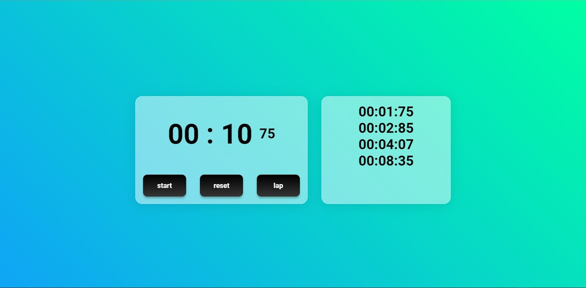

## StopWatch-Js

#

Simple StopWatch webpage with start/stop, reset and lap functionalities

## Screenshot

<h3 align="center">
        
    </h3>

#

## Stack used:

**Front-end**: HTML, CSS, Javascript

## License

[MIT](https://choosealicense.com/licenses/mit/)
